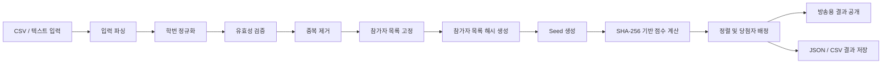
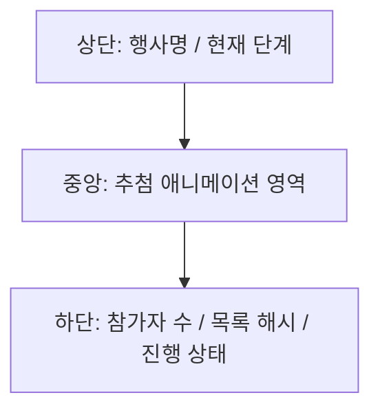
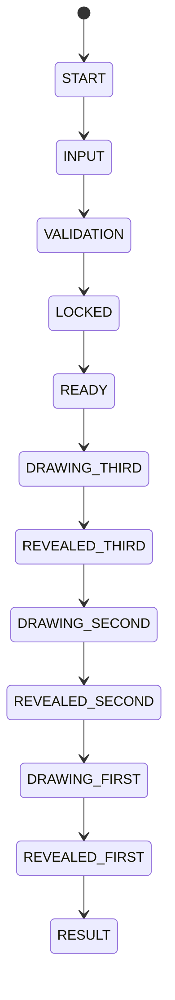

# 경품 추첨 방송용 웹앱 개발 문서

## 1. 문서 개요

### 1.1 목적

본 문서는 학번 기반 경품 추첨을 공정하고 시각적으로 진행하기 위한 **방송용 웹 추첨 프로그램**의 개발 계획을 정의한다.

프로그램은 참가자 학번 목록을 입력받아 다음과 같이 당첨자를 추첨한다.

- 1등: 1명
- 2등: 1명
- 3등: 20명

추첨은 인스타그램 라이브 방송에서 사용할 수 있도록 시각적 연출을 포함하며, 결과에 대한 신뢰성을 확보하기 위해 참가자 목록 해시, 난수 seed, 결과 저장 기능을 제공한다.

### 1.2 개발 방향

본 프로젝트는 **GitHub Pages에 배포 가능한 정적 웹앱**으로 개발한다.

서버나 데이터베이스 없이 브라우저 내부에서만 동작하며, 참가자 학번 데이터는 사용자의 로컬 브라우저에서만 처리한다. 따라서 학번 CSV 파일은 GitHub 레포지토리에 포함하지 않는다.

---

## 2. 핵심 목표

### 2.1 기능 목표

1. 학번 목록 CSV 또는 텍스트 입력 지원
2. 학번 정규화, 중복 제거, 유효성 검증
3. 참가자 목록 고정 기능
4. 참가자 목록 해시 표시
5. seed 기반 재현 가능한 랜덤 추첨
6. 1등 1명, 2등 1명, 3등 20명 추첨
7. 방송용 시각 효과 제공
8. 결과 JSON/CSV 다운로드
9. 전체 화면 모드 지원
10. 학번 마스킹 표시

### 2.2 비기능 목표

1. 백엔드 없이 정적 웹앱으로 동작
2. GitHub Pages 배포 가능
3. 모바일보다는 데스크톱 방송 환경에 최적화
4. 인스타그램 라이브 화면 공유에 적합한 UI 제공
5. 개인정보 노출 최소화
6. 추첨 결과 재현 가능성 확보
7. 행사 직전 리허설 가능

---

## 3. 비목표

다음 기능은 MVP 범위에 포함하지 않는다.

1. 회원가입 / 로그인
2. 서버 저장소
3. 관리자 계정 권한 관리
4. 참가자 실시간 등록
5. 외부 DB 연동
6. 자동 인스타그램 방송 연동
7. 모바일 앱 패키징
8. 경품 수령 확인 시스템

---

## 4. 추천 기술 스택

### 4.1 프론트엔드

| 항목 | 기술 |
|---|---|
| 빌드 도구 | Vite |
| UI 프레임워크 | React |
| 언어 | TypeScript |
| 스타일링 | Tailwind CSS |
| 애니메이션 | Framer Motion |
| CSV 파싱 | PapaParse |
| 폭죽 효과 | canvas-confetti |
| 해시/난수 | Web Crypto API |
| 배포 | GitHub Pages |

### 4.2 선택 이유

#### Vite + React + TypeScript

- 구현 속도가 빠르다.
- 상태 기반 화면 전환에 적합하다.
- GitHub Pages 정적 배포가 쉽다.
- TypeScript를 통해 추첨 로직의 실수를 줄일 수 있다.

#### Tailwind CSS

- 빠른 UI 구성에 적합하다.
- 방송용 화면의 레이아웃과 반응형 처리가 쉽다.
- 디자인 시스템을 간단히 통일할 수 있다.

#### Framer Motion

- 카드 플립, 순차 공개, 카운트다운 등 방송용 애니메이션 구현에 적합하다.

#### Web Crypto API

- `crypto.getRandomValues()`를 통해 seed 생성 가능
- `crypto.subtle.digest()`를 통해 SHA-256 해시 계산 가능
- 브라우저 내장 기능이므로 별도 서버가 필요 없다.

---

## 5. 전체 아키텍처



### 5.1 데이터 흐름

1. 사용자가 학번 목록 CSV를 업로드하거나 텍스트로 붙여넣는다.
2. 앱이 입력 데이터를 파싱한다.
3. 학번 문자열을 정규화한다.
4. 잘못된 값과 중복 값을 제거한다.
5. 최종 참가자 목록을 고정한다.
6. 참가자 목록의 SHA-256 해시를 생성한다.
7. 추첨 seed를 생성한다.
8. 각 참가자에 대해 `SHA-256(seed + studentId)` 값을 계산한다.
9. 해시 점수가 작은 순서대로 당첨자를 선정한다.
10. 3등, 2등, 1등 순서로 화면에 공개한다.
11. 결과 파일을 다운로드한다.

---

## 6. 사용자 시나리오

### 6.1 운영자 시나리오

1. 운영자는 GitHub Pages로 배포된 추첨 웹앱에 접속한다.
2. CSV 파일을 업로드한다.
3. 앱에서 참가자 수, 중복 제거 수, 오류 항목을 확인한다.
4. 문제가 없으면 참가자 목록을 고정한다.
5. 방송 화면에 참가자 수와 참가자 목록 해시를 보여준다.
6. 추첨 시작 버튼을 누른다.
7. 3등 20명을 먼저 공개한다.
8. 2등 1명을 공개한다.
9. 1등 1명을 마지막으로 공개한다.
10. 결과 화면을 보여준다.
11. 결과 JSON/CSV 파일을 저장한다.

### 6.2 시청자 시나리오

1. 시청자는 인스타그램 라이브로 추첨 방송을 본다.
2. 화면에서 참가자 수와 추첨 진행 상태를 확인한다.
3. 3등, 2등, 1등 순서로 당첨자를 확인한다.
4. 학번은 마스킹된 형태로 확인한다.

---

## 7. 화면 구성

### 7.1 화면 목록

| 화면 ID | 화면명 | 설명 |
|---|---|---|
| S01 | 시작 화면 | 행사명, 추첨 시작 안내 |
| S02 | 참가자 입력 화면 | CSV 업로드 또는 텍스트 입력 |
| S03 | 참가자 검증 화면 | 총 입력 수, 유효 수, 중복 수, 오류 목록 표시 |
| S04 | 참가자 목록 고정 화면 | 최종 참가자 수, 목록 해시 표시 |
| S05 | 추첨 대기 화면 | 추첨 시작 전 카운트다운 |
| S06 | 3등 추첨 화면 | 20명 순차 공개 |
| S07 | 2등 추첨 화면 | 1명 카드 공개 |
| S08 | 1등 추첨 화면 | 1명 강조 공개 |
| S09 | 최종 결과 화면 | 전체 당첨자 목록 표시 |
| S10 | 결과 저장 화면 | JSON/CSV 다운로드 |

---

## 8. UI / UX 설계

### 8.1 디자인 방향

방송용 화면이므로 일반 관리자 페이지보다 시각적 임팩트가 중요하다.

권장 방향은 다음과 같다.

- 어두운 배경 또는 그라디언트 배경
- 큰 타이포그래피
- 카드 기반 당첨자 표시
- 16:9 화면 기준 레이아웃
- 과하지 않은 애니메이션
- 당첨자 공개 시 명확한 시각적 강조
- 학번 마스킹 표시
- 행사명과 추첨 단계가 항상 보이도록 구성

### 8.2 주요 시각 효과

| 효과 | 사용 위치 | 설명 |
|---|---|---|
| 카운트다운 | 추첨 시작 전 | 3, 2, 1 숫자 애니메이션 |
| 슬롯머신 효과 | 당첨자 공개 전 | 학번 숫자가 빠르게 바뀌는 효과 |
| 카드 플립 | 당첨자 공개 | 뒷면에서 앞면으로 전환 |
| 순차 등장 | 3등 공개 | 20명 카드가 순서대로 나타남 |
| 폭죽 효과 | 1등 공개 | 최종 당첨자 발표 시 사용 |
| 화면 전환 | 단계 이동 | 부드러운 fade/slide 전환 |

### 8.3 방송용 화면 권장 레이아웃



### 8.4 학번 표시 방식

전체 학번을 방송에 노출하지 않고 마스킹한다.

예시:

| 원본 | 표시 |
|---|---|
| 202312345 | 2023***345 |
| 2024123456 | 2024****456 |

권장 함수:

```ts
function maskStudentId(id: string): string {
  if (id.length <= 6) return id[0] + '*'.repeat(id.length - 2) + id[id.length - 1];
  return id.slice(0, 4) + '*'.repeat(Math.max(3, id.length - 7)) + id.slice(-3);
}
```

---

## 9. 입력 데이터 설계

### 9.1 CSV 형식

기본 CSV 형식은 다음과 같다.

```csv
student_id
202312345
202312346
202312347
```

또는 헤더 없이 한 줄에 하나씩 입력해도 처리할 수 있도록 한다.

```txt
202312345
202312346
202312347
```

### 9.2 지원 입력 방식

1. CSV 파일 업로드
2. 텍스트 직접 붙여넣기
3. 테스트용 더미 데이터 생성

### 9.3 학번 정규화 규칙

입력값에 대해 다음 처리를 수행한다.

1. 앞뒤 공백 제거
2. 내부 공백 제거 여부는 설정 가능하게 처리
3. 숫자만 허용하는 것을 기본값으로 설정
4. 빈 문자열 제거
5. 중복 제거
6. 정렬 후 최종 목록 구성

### 9.4 학번 유효성 규칙

기본 MVP에서는 다음 규칙을 사용한다.

```ts
const STUDENT_ID_REGEX = /^\d{6,12}$/;
```

설명:

- 숫자만 허용
- 6자리 이상 12자리 이하
- 행사 환경에 따라 규칙 변경 가능

---

## 10. 데이터 모델

### 10.1 Participant

```ts
export interface Participant {
  id: string;
  normalizedId: string;
  maskedId: string;
}
```

### 10.2 ValidationResult

```ts
export interface ValidationResult {
  totalRows: number;
  validCount: number;
  duplicateCount: number;
  invalidRows: InvalidRow[];
  participants: Participant[];
}
```

### 10.3 InvalidRow

```ts
export interface InvalidRow {
  rowIndex: number;
  rawValue: string;
  reason: 'EMPTY' | 'INVALID_FORMAT' | 'DUPLICATE';
}
```

### 10.4 PrizeConfig

```ts
export interface PrizeConfig {
  rank: '1등' | '2등' | '3등';
  count: number;
  revealOrder: number;
}
```

기본 설정:

```ts
export const DEFAULT_PRIZES: PrizeConfig[] = [
  { rank: '3등', count: 20, revealOrder: 1 },
  { rank: '2등', count: 1, revealOrder: 2 },
  { rank: '1등', count: 1, revealOrder: 3 },
];
```

### 10.5 DrawResult

```ts
export interface DrawResult {
  eventName: string;
  participantCount: number;
  participantHash: string;
  seed: string;
  algorithm: string;
  winners: Record<string, Participant[]>;
  generatedAt: string;
  appVersion: string;
}
```

---

## 11. 추첨 알고리즘 설계

### 11.1 요구사항

추첨 알고리즘은 다음 조건을 만족해야 한다.

1. 무작위성이 있어야 한다.
2. 같은 입력과 같은 seed를 사용하면 결과가 재현되어야 한다.
3. 특정 참가자를 임의로 조작하기 어렵게 해야 한다.
4. 결과 검증을 위해 seed와 참가자 해시를 저장해야 한다.

### 11.2 기본 알고리즘

각 참가자에 대해 다음 값을 계산한다.

```txt
score = SHA-256(seed + ':' + normalizedStudentId)
```

이후 score를 오름차순으로 정렬하고, 앞에서부터 당첨자를 배정한다.

배정 순서:

1. 3등 20명
2. 2등 1명
3. 1등 1명

단, 공개 순서는 3등 → 2등 → 1등이지만, 내부적으로는 전체 순위를 한 번에 계산해도 된다.

### 11.3 참가자 목록 해시

참가자 목록 해시는 다음 방식으로 생성한다.

1. 정규화된 학번 목록을 오름차순 정렬한다.
2. 줄바꿈으로 연결한다.
3. SHA-256 해시를 계산한다.

```txt
participantHash = SHA-256(sortedStudentIds.join('\n'))
```

### 11.4 Seed 생성

seed는 브라우저의 보안 난수 생성 기능을 사용한다.

```ts
function generateSeed(): string {
  const bytes = new Uint8Array(32);
  crypto.getRandomValues(bytes);
  return Array.from(bytes)
    .map((b) => b.toString(16).padStart(2, '0'))
    .join('');
}
```

### 11.5 SHA-256 함수

```ts
async function sha256Hex(input: string): Promise<string> {
  const encoder = new TextEncoder();
  const data = encoder.encode(input);
  const hashBuffer = await crypto.subtle.digest('SHA-256', data);
  const hashArray = Array.from(new Uint8Array(hashBuffer));
  return hashArray.map((b) => b.toString(16).padStart(2, '0')).join('');
}
```

### 11.6 당첨자 선정 함수 예시

```ts
export async function drawWinners(
  participants: Participant[],
  seed: string,
  prizes: PrizeConfig[]
): Promise<DrawResult> {
  const scored = await Promise.all(
    participants.map(async (participant) => ({
      participant,
      score: await sha256Hex(`${seed}:${participant.normalizedId}`),
    }))
  );

  scored.sort((a, b) => a.score.localeCompare(b.score));

  const winners: Record<string, Participant[]> = {};
  let cursor = 0;

  const drawOrder = [...prizes].sort((a, b) => a.revealOrder - b.revealOrder);

  for (const prize of drawOrder) {
    winners[prize.rank] = scored
      .slice(cursor, cursor + prize.count)
      .map((item) => item.participant);
    cursor += prize.count;
  }

  return {
    eventName: 'ST:talk 경품 추첨',
    participantCount: participants.length,
    participantHash: await createParticipantHash(participants),
    seed,
    algorithm: 'SHA-256(seed + normalizedStudentId), ascending sort',
    winners,
    generatedAt: new Date().toISOString(),
    appVersion: import.meta.env.VITE_APP_VERSION ?? 'local',
  };
}
```

---

## 12. 상태 관리 설계

### 12.1 앱 상태

```ts
export type AppStep =
  | 'START'
  | 'INPUT'
  | 'VALIDATION'
  | 'LOCKED'
  | 'READY'
  | 'DRAWING_THIRD'
  | 'REVEALED_THIRD'
  | 'DRAWING_SECOND'
  | 'REVEALED_SECOND'
  | 'DRAWING_FIRST'
  | 'REVEALED_FIRST'
  | 'RESULT';
```

### 12.2 상태 전이



### 12.3 상태 저장 정책

MVP에서는 LocalStorage 저장을 기본적으로 사용하지 않는다.

이유:

1. 민감할 수 있는 학번 데이터가 브라우저에 남을 수 있다.
2. 방송용 앱은 매 행사마다 새로 실행하는 것이 안전하다.
3. 결과 파일은 명시적으로 다운로드하도록 한다.

단, 개발 및 리허설용으로 더미 데이터는 코드 내부에 둘 수 있다.

---

## 13. 컴포넌트 설계

### 13.1 컴포넌트 구조

```txt
src/
  app/
    App.tsx
    routes.ts
  components/
    layout/
      BroadcastFrame.tsx
      StepHeader.tsx
      FooterStatus.tsx
    input/
      CsvUploader.tsx
      TextPasteInput.tsx
      ValidationSummary.tsx
      InvalidRowsTable.tsx
    draw/
      Countdown.tsx
      SlotMachineText.tsx
      WinnerCard.tsx
      WinnerGrid.tsx
      ConfettiLayer.tsx
    result/
      ResultSummary.tsx
      DownloadButtons.tsx
  lib/
    parseParticipants.ts
    validateStudentId.ts
    maskStudentId.ts
    crypto.ts
    drawWinners.ts
    exportResult.ts
  types/
    raffle.ts
  styles/
    globals.css
```

### 13.2 주요 컴포넌트 설명

#### BroadcastFrame

방송용 공통 프레임을 담당한다.

역할:

- 16:9 레이아웃 유지
- 배경 스타일 적용
- 상단 제목 영역 제공
- 하단 상태 영역 제공

#### CsvUploader

CSV 파일 업로드를 담당한다.

역할:

- 파일 선택
- 파일 확장자 확인
- 텍스트 읽기
- 파싱 함수 호출

#### ValidationSummary

입력 검증 결과를 요약한다.

표시 항목:

- 총 입력 행 수
- 유효 참가자 수
- 중복 수
- 오류 수

#### WinnerCard

당첨자 한 명을 표시하는 카드 컴포넌트다.

표시 항목:

- 등수
- 마스킹된 학번
- 공개 애니메이션

#### WinnerGrid

3등 20명처럼 여러 명을 그리드로 표시하는 컴포넌트다.

#### DownloadButtons

결과 파일 다운로드를 담당한다.

지원 형식:

- JSON
- CSV

---

## 14. 결과 저장 설계

### 14.1 JSON 결과 파일

파일명 예시:

```txt
raffle-result-2026-05-23.json
```

내용 예시:

```json
{
  "eventName": "ST:talk 경품 추첨",
  "participantCount": 183,
  "participantHash": "sha256-...",
  "seed": "7fd9a3...",
  "algorithm": "SHA-256(seed + normalizedStudentId), ascending sort",
  "winners": {
    "1등": ["2023***345"],
    "2등": ["2024***210"],
    "3등": ["2022***111", "2021***222"]
  },
  "generatedAt": "2026-05-23T12:00:00.000Z",
  "appVersion": "1.0.0"
}
```

주의:

- 방송 공개용 결과 파일에는 마스킹 학번만 포함한다.
- 내부 확인용 원본 결과 파일을 저장할 경우 파일 관리에 주의해야 한다.

### 14.2 CSV 결과 파일

```csv
rank,masked_student_id
1등,2023***345
2등,2024***210
3등,2022***111
3등,2021***222
```

---

## 15. 개인정보 및 보안 설계

### 15.1 기본 원칙

1. 학번 원본 데이터는 서버로 전송하지 않는다.
2. GitHub 레포지토리에 참가자 CSV를 커밋하지 않는다.
3. 방송 화면에는 마스킹된 학번만 표시한다.
4. 결과 파일에는 원칙적으로 마스킹된 학번만 저장한다.
5. 참가자 목록 해시는 검증 목적 외에는 사용하지 않는다.
6. LocalStorage에 학번을 자동 저장하지 않는다.

### 15.2 Git 관리 주의사항

`.gitignore`에 다음 패턴을 추가한다.

```gitignore
*.csv
participants*.json
raffle-result*.json
private-data/
```

### 15.3 방송 전 체크리스트

- [ ] CSV 파일이 GitHub에 올라가지 않았는가?
- [ ] 화면에 원본 학번이 노출되지 않는가?
- [ ] 결과 화면이 마스킹 학번만 보여주는가?
- [ ] 참가자 수가 예상과 맞는가?
- [ ] 중복 제거 결과를 확인했는가?
- [ ] 테스트 데이터가 아닌 실제 데이터로 고정했는가?
- [ ] 리허설 결과와 실제 결과가 섞이지 않았는가?

---

## 16. 공정성 설계

### 16.1 공정성 확보 방법

1. 참가자 목록을 추첨 전 고정한다.
2. 참가자 목록 해시를 화면에 표시한다.
3. 추첨 seed를 생성하고 표시한다.
4. seed와 참가자 목록 해시를 결과 파일에 저장한다.
5. 알고리즘을 공개 가능한 형태로 유지한다.

### 16.2 검증 가능성

추첨 이후 다음 값이 있으면 결과를 재현할 수 있다.

1. 정규화된 참가자 목록
2. 참가자 목록 해시
3. seed
4. 추첨 알고리즘
5. 앱 버전

### 16.3 조작 방지 UX

추첨 도중 참가자 목록이 변경되지 않도록 `참가자 목록 고정` 이후에는 입력 화면으로 돌아갈 수 없게 한다.

되돌아가려면 다음과 같은 경고를 표시한다.

```txt
참가자 목록을 다시 수정하면 기존 seed와 추첨 결과가 모두 초기화됩니다.
계속하시겠습니까?
```

---

## 17. 프로젝트 구조

### 17.1 권장 레포지토리 구조

```txt
raffle-live-draw/
  README.md
  package.json
  vite.config.ts
  tsconfig.json
  index.html
  public/
    favicon.svg
    og-image.png
  src/
    main.tsx
    App.tsx
    types/
      raffle.ts
    lib/
      crypto.ts
      drawWinners.ts
      exportResult.ts
      maskStudentId.ts
      parseParticipants.ts
      validateStudentId.ts
    components/
      layout/
      input/
      draw/
      result/
    styles/
      globals.css
  docs/
    development.md
    operation-guide.md
    rehearsal-checklist.md
```

### 17.2 브랜치 전략

소규모 프로젝트이므로 단순 전략을 사용한다.

```txt
main       배포 브랜치
feature/*  기능 개발 브랜치
```

---

## 18. 개발 단계

### 18.1 Phase 1: MVP 추첨 기능

목표:

- CSV 입력
- 학번 검증
- 중복 제거
- 추첨 로직
- 결과 표시

작업 목록:

- [ ] Vite React TypeScript 프로젝트 생성
- [ ] Tailwind CSS 설정
- [ ] CSV 업로드 컴포넌트 구현
- [ ] 텍스트 붙여넣기 입력 구현
- [ ] 학번 정규화 함수 구현
- [ ] 유효성 검증 함수 구현
- [ ] 중복 제거 로직 구현
- [ ] seed 생성 함수 구현
- [ ] SHA-256 함수 구현
- [ ] 추첨 로직 구현
- [ ] 결과 화면 구현

완료 기준:

- 테스트용 학번 100개를 입력했을 때 1등 1명, 2등 1명, 3등 20명이 중복 없이 나온다.

### 18.2 Phase 2: 방송용 UI

목표:

- 화면 전환
- 당첨자 공개 연출
- 전체 화면 최적화

작업 목록:

- [ ] BroadcastFrame 구현
- [ ] 추첨 단계별 화면 구현
- [ ] 카운트다운 구현
- [ ] 슬롯머신 텍스트 효과 구현
- [ ] WinnerCard 애니메이션 구현
- [ ] 3등 WinnerGrid 구현
- [ ] 1등 confetti 효과 구현
- [ ] 전체 화면 버튼 구현

완료 기준:

- 16:9 화면에서 인스타그램 방송 공유에 적합하게 보인다.
- 3등, 2등, 1등 순서로 자연스럽게 공개된다.

### 18.3 Phase 3: 공정성 및 결과 저장

목표:

- 참가자 목록 해시
- seed 표시
- 결과 다운로드

작업 목록:

- [ ] 참가자 목록 해시 생성
- [ ] 목록 고정 UI 구현
- [ ] seed 표시 UI 구현
- [ ] 결과 JSON 다운로드 구현
- [ ] 결과 CSV 다운로드 구현
- [ ] 앱 버전 표시

완료 기준:

- 결과 파일에 seed, 참가자 수, 참가자 해시, 당첨 결과가 포함된다.

### 18.4 Phase 4: 배포 및 리허설

목표:

- GitHub Pages 배포
- 행사 전 리허설

작업 목록:

- [ ] GitHub Actions 배포 설정
- [ ] README 작성
- [ ] 운영 가이드 작성
- [ ] 리허설 체크리스트 작성
- [ ] 더미 데이터로 리허설
- [ ] 실제 CSV 입력 테스트

완료 기준:

- GitHub Pages URL에서 앱이 정상 동작한다.
- 실제 방송 환경에서 전체 화면 공유가 가능하다.

---

## 19. 테스트 계획

### 19.1 단위 테스트 대상

| 함수 | 테스트 내용 |
|---|---|
| normalizeStudentId | 공백 제거, 문자열 정규화 |
| validateStudentId | 유효/무효 학번 판별 |
| maskStudentId | 학번 마스킹 처리 |
| createParticipantHash | 동일 목록의 동일 해시 보장 |
| generateSeed | seed 길이 및 형식 확인 |
| drawWinners | 중복 없는 당첨자 선정 |
| exportResultToCsv | CSV 형식 검증 |

### 19.2 주요 테스트 케이스

#### TC01: 정상 입력

입력:

```txt
202312345
202312346
202312347
```

기대 결과:

- 유효 참가자 3명
- 오류 0개
- 중복 0개

#### TC02: 중복 입력

입력:

```txt
202312345
202312345
202312346
```

기대 결과:

- 유효 참가자 2명
- 중복 1개

#### TC03: 잘못된 입력

입력:

```txt
202312345
abc

202312346
```

기대 결과:

- 유효 참가자 2명
- 오류 1개
- 빈 줄 제외

#### TC04: 당첨자 수 부족

조건:

- 참가자 10명
- 필요한 당첨자 22명

기대 결과:

- 추첨 불가 오류 표시

#### TC05: 재현성 검증

조건:

- 같은 참가자 목록
- 같은 seed

기대 결과:

- 항상 같은 당첨자 결과 생성

---

## 20. 예외 처리

### 20.1 참가자 수 부족

필요 당첨자 수보다 참가자가 적으면 추첨을 막는다.

문구 예시:

```txt
참가자 수가 부족합니다.
현재 참가자: 18명
필요 당첨자: 22명
```

### 20.2 CSV 파싱 실패

문구 예시:

```txt
CSV 파일을 읽을 수 없습니다. 파일 형식 또는 인코딩을 확인해주세요.
```

### 20.3 브라우저 Crypto 미지원

문구 예시:

```txt
현재 브라우저에서는 보안 난수 또는 SHA-256 기능을 사용할 수 없습니다.
최신 Chrome, Edge, Safari 브라우저에서 다시 시도해주세요.
```

### 20.4 추첨 후 재입력 시도

문구 예시:

```txt
참가자 목록을 수정하면 현재 추첨 결과가 초기화됩니다.
계속하시겠습니까?
```

---

## 21. 배포 계획

### 21.1 GitHub Pages 배포 방식

Vite 프로젝트 기준으로 GitHub Pages 배포를 설정한다.

`vite.config.ts` 예시:

```ts
import { defineConfig } from 'vite';
import react from '@vitejs/plugin-react';

export default defineConfig({
  plugins: [react()],
  base: '/raffle-live-draw/',
});
```

### 21.2 GitHub Actions 예시

```yaml
name: Deploy to GitHub Pages

on:
  push:
    branches: [main]

permissions:
  contents: read
  pages: write
  id-token: write

concurrency:
  group: pages
  cancel-in-progress: false

jobs:
  build:
    runs-on: ubuntu-latest
    steps:
      - name: Checkout
        uses: actions/checkout@v4
      - name: Setup Node
        uses: actions/setup-node@v4
        with:
          node-version: 22
          cache: npm
      - name: Install dependencies
        run: npm ci
      - name: Build
        run: npm run build
      - name: Upload artifact
        uses: actions/upload-pages-artifact@v3
        with:
          path: ./dist

  deploy:
    environment:
      name: github-pages
      url: ${{ steps.deployment.outputs.page_url }}
    runs-on: ubuntu-latest
    needs: build
    steps:
      - name: Deploy to GitHub Pages
        id: deployment
        uses: actions/deploy-pages@v4
```

---

## 22. 운영 가이드

### 22.1 방송 전 준비

- [ ] 최신 배포 URL 접속 확인
- [ ] 브라우저 확대/축소 100% 확인
- [ ] 전체 화면 모드 테스트
- [ ] 더미 데이터로 리허설
- [ ] 실제 CSV 파일 준비
- [ ] CSV 파일에 중복/오류가 없는지 확인
- [ ] 화면 공유 테스트
- [ ] 학번 마스킹 표시 확인
- [ ] 결과 다운로드 위치 확인

### 22.2 방송 중 진행 순서

1. 앱 접속
2. 행사명 확인
3. CSV 업로드
4. 참가자 검증 결과 확인
5. 참가자 목록 고정
6. 참가자 수와 목록 해시 화면 공개
7. 추첨 시작
8. 3등 공개
9. 2등 공개
10. 1등 공개
11. 최종 결과 화면 공개
12. 결과 파일 저장

### 22.3 방송 후 처리

- [ ] 결과 JSON 저장
- [ ] 결과 CSV 저장
- [ ] 실제 수령자 확인용 파일은 별도 안전한 위치에 보관
- [ ] 방송 공개용 결과는 마스킹 학번만 사용
- [ ] 참가자 원본 CSV는 필요 기간 이후 삭제

---

## 23. README 초안

```md
# Raffle Live Draw

학번 기반 경품 추첨을 위한 방송용 정적 웹앱입니다.

## Features

- CSV / 텍스트 기반 참가자 입력
- 학번 검증 및 중복 제거
- SHA-256 기반 재현 가능한 추첨
- 참가자 목록 해시 표시
- Seed 기반 결과 검증
- 3등 / 2등 / 1등 순차 공개
- 방송용 애니메이션 UI
- 결과 JSON / CSV 다운로드
- GitHub Pages 배포 지원

## Privacy

참가자 학번 데이터는 서버로 전송되지 않으며 브라우저 내부에서만 처리됩니다.
CSV 파일을 GitHub 레포지토리에 커밋하지 마세요.

## Development

```bash
npm install
npm run dev
```

## Build

```bash
npm run build
```

## Deploy

GitHub Pages 배포는 GitHub Actions를 통해 자동으로 수행됩니다.
```

---

## 24. MVP 완료 기준

MVP는 다음 조건을 만족하면 완료로 판단한다.

- [ ] CSV 또는 텍스트 입력이 가능하다.
- [ ] 학번 유효성 검증이 가능하다.
- [ ] 중복 학번이 제거된다.
- [ ] 참가자 목록을 고정할 수 있다.
- [ ] 참가자 목록 해시가 표시된다.
- [ ] seed가 생성된다.
- [ ] 1등 1명, 2등 1명, 3등 20명을 중복 없이 추첨한다.
- [ ] 학번이 마스킹되어 표시된다.
- [ ] 3등 → 2등 → 1등 순서로 공개된다.
- [ ] 결과 JSON/CSV 다운로드가 가능하다.
- [ ] GitHub Pages에서 정상 동작한다.

---

## 25. 향후 확장 아이디어

MVP 이후 다음 기능을 추가할 수 있다.

1. 경품 이름 설정
2. 등수별 이미지 표시
3. 행사 로고 업로드
4. 테마 컬러 변경
5. 추첨 사운드 효과
6. OBS 화면 최적화 모드
7. 당첨자 재추첨 기능
8. 제외자 목록 입력
9. 사전 당첨 제외 조건 설정
10. 검증 페이지 별도 제공
11. QR 코드로 결과 페이지 공유
12. 오프라인 PWA 지원

---

## 26. 우선순위 요약

가장 먼저 구현해야 할 것은 시각 효과가 아니라 **신뢰 가능한 추첨 로직**이다.

우선순위는 다음과 같다.

1. 입력 검증
2. 중복 제거
3. seed 기반 추첨
4. 참가자 목록 해시
5. 결과 저장
6. 방송용 시각 효과
7. 디자인 polish

---

## 27. 최종 권장 구현 방식

본 프로젝트는 다음 방식으로 개발한다.

- `Vite + React + TypeScript` 기반 정적 웹앱
- `Tailwind CSS` 기반 방송용 UI
- `Framer Motion` 기반 화면 전환 및 카드 애니메이션
- `Web Crypto API` 기반 seed 생성 및 SHA-256 해시 계산
- `PapaParse` 기반 CSV 파싱
- `canvas-confetti` 기반 1등 발표 효과
- `GitHub Pages` 배포
- 참가자 CSV는 레포지토리에 포함하지 않고 방송 당일 브라우저에서 로컬 업로드

이 구조는 구현 난이도가 낮고, 배포가 간단하며, 방송용 시각 효과와 공정성 검증을 모두 만족한다.

